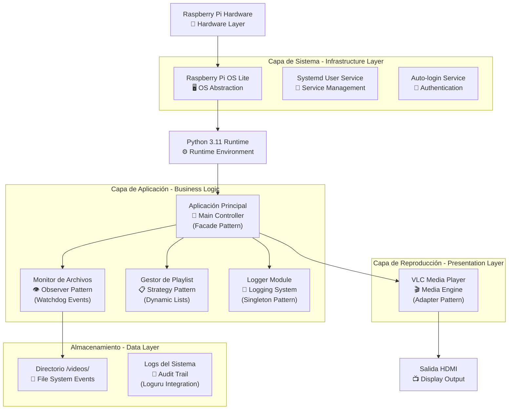
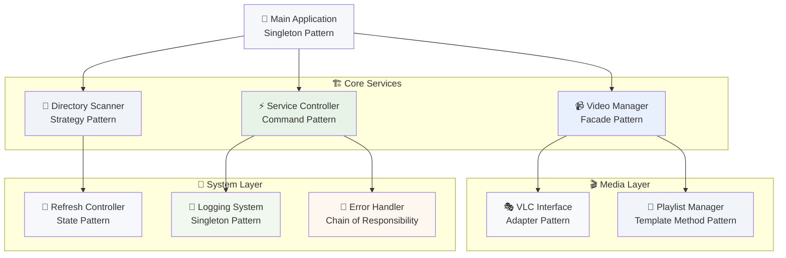

# Documento de Arquitectura Técnica - Sistema de Cartelería Digital Raspberry Pi 3 A+

## 1. Diseño de Arquitectura



## 2. Descripción de Tecnologías

* **Hardware**: Raspberry Pi 3 A+ (512MB RAM, ARM Cortex-A53)

* **Sistema Base**: Raspberry Pi OS Lite (Debian-based, headless)

* **Runtime**: Python 3.11 + uv (gestor de paquetes)

* **Reproducción**: VLC Media Player + python-vlc bindings

* **Refresh**: Escaneo periódico al completar ciclos

* **Servicio**: systemd user service

* **Logging**: loguru (sistema de logging unificado)

* **Dependencias adicionales**: OpenCV, FFmpeg-python

## 3. Definiciones de Rutas

| Ruta                                | Propósito                              |
| ----------------------------------- | -------------------------------------- |
| `/home/pi/kdx-pi-signage/`          | Directorio principal de la aplicación  |
| `/home/pi/kdx-pi-signage/videos/`   | Directorio de videos para reproducción |
| `/home/pi/kdx-pi-signage/logs/`     | Logs del sistema y errores (loguru)    |
| `/home/pi/kdx-pi-signage/logger.py` | Módulo de logging unificado con loguru |
| `/home/pi/.config/systemd/user/`    | Configuración del servicio de usuario  |

## 4. Definiciones de API (Si incluye servicios backend)

### 4.1 API Interna

Clases principales del sistema (código en inglés, documentación en castellano):

**Clase** **`VideoPlayer`**

```python
class VideoPlayer:
    """Reproductor de video que utiliza VLC para mostrar contenido multimedia."""
    
    def __init__(self, video_path: str):
        """Inicializa el reproductor con la ruta del video."""
        pass
    
    def play(self) -> bool:
        """Inicia la reproducción del video en pantalla completa."""
        pass
    
    def stop(self) -> bool:
        """Detiene la reproducción actual del video."""
        pass
    
    def is_playing(self) -> bool:
        """Verifica si hay un video reproduciéndose actualmente."""
        pass
```

**Clase** **`VideoScanner`**

```python
class VideoScanner:
    """Escáner de directorio que busca archivos de video disponibles."""
    
    def __init__(self, directory_path: str):
        """Inicializa el escáner con la ruta del directorio de videos."""
        pass
    
    def scan_videos(self) -> List[str]:
        """Escanea el directorio y retorna lista de archivos de video."""
        pass
    
    def refresh_playlist(self) -> List[str]:
        """Actualiza la lista de reproducción con videos encontrados."""
        pass
```

**Clase** **`PlaylistManager`**

```python
class PlaylistManager:
    """Gestor de listas de reproducción para videos."""
    
    def __init__(self, video_list: List[str]):
        """Inicializa el gestor con una lista de videos."""
        pass
    
    def get_next_video(self) -> str:
        """Obtiene el siguiente video en la lista de reproducción."""
        pass
    
    def reset_playlist(self) -> None:
        """Reinicia la lista de reproducción al primer video."""
        pass
```

**Clase** **`Logger`** **(Singleton Pattern)**

```python
class Logger:
    """Sistema de logging unificado usando loguru (Singleton Pattern)."""
    
    _instance = None
    
    def __new__(cls):
        """Implementa el patrón Singleton para el logger."""
        if cls._instance is None:
            cls._instance = super().__new__(cls)
        return cls._instance
    
    def setup_logger(self, log_dir: str = "/home/pi/kdx-pi-signage/logs") -> None:
        """Configura el sistema de logging con loguru."""
        pass
    
    def get_logger(self):
        """Obtiene la instancia del logger configurado."""
        pass
```

### 4.2 Configuración del Servicio

**Archivo de servicio systemd**

```ini
[Unit]
Description=KDX Pi Signage Service
After=graphical-session.target

[Service]
Type=simple
ExecStart=/home/pi/.local/bin/uv run python main.py
WorkingDirectory=/home/pi/kdx-pi-signage
Restart=always
RestartSec=10
Environment=DISPLAY=:0

[Install]
WantedBy=default.target
```

## 5. Arquitectura del Servidor



## 6. Estructuras de Datos

### 6.1 Estructuras Simples en Memoria

El sistema no utiliza base de datos, solo maneja estructuras temporales en memoria y archivos de log.

### 6.2 Definición de Estructuras

**Modelos Pydantic para Estructuras de Datos**

```python
from pydantic import BaseModel, Field, validator
from typing import List, Optional
from pathlib import Path

# Configuración del sistema con validación
class SystemConfig(BaseModel):
    """Configuración principal del sistema de cartelería digital."""
    
    video_dir: Path = Field(
        default=Path('/home/pi/kdx-pi-signage/videos'),
        description="Directorio donde se almacenan los videos"
    )
    log_dir: Path = Field(
        default=Path('/home/pi/kdx-pi-signage/logs'),
        description="Directorio para archivos de log"
    )
    supported_formats: List[str] = Field(
        default=['.mp4', '.avi', '.mkv', '.mov', '.wmv'],
        description="Formatos de video soportados"
    )
    vlc_options: List[str] = Field(
        default=['--intf', 'dummy', '--fullscreen', '--no-osd'],
        description="Opciones de configuración para VLC"
    )
    refresh_interval: int = Field(
        default=30,
        ge=5,
        le=300,
        description="Intervalo de actualización en segundos"
    )
    
    @validator('video_dir', 'log_dir')
    def validate_directories(cls, v):
        """Valida que los directorios existan o puedan crearse."""
        if isinstance(v, str):
            v = Path(v)
        v.mkdir(parents=True, exist_ok=True)
        return v
    
    @validator('supported_formats')
    def validate_formats(cls, v):
        """Valida que los formatos tengan el formato correcto."""
        for fmt in v:
            if not fmt.startswith('.'):
                raise ValueError(f"Formato debe comenzar con punto: {fmt}")
        return v

# Estado del reproductor con validación
class PlayerState(BaseModel):
    """Estado actual del reproductor de video."""
    
    current_video: Optional[str] = Field(
        default=None,
        description="Ruta del video actualmente en reproducción"
    )
    is_playing: bool = Field(
        default=False,
        description="Indica si hay un video reproduciéndose"
    )
    playlist_index: int = Field(
        default=0,
        ge=0,
        description="Índice actual en la lista de reproducción"
    )
    total_videos: int = Field(
        default=0,
        ge=0,
        description="Total de videos en la playlist"
    )
    playback_errors: int = Field(
        default=0,
        ge=0,
        description="Contador de errores de reproducción"
    )
    
    @validator('current_video')
    def validate_video_path(cls, v):
        """Valida que el archivo de video exista si se especifica."""
        if v is not None and not Path(v).exists():
            raise ValueError(f"Archivo de video no encontrado: {v}")
        return v

# Información de video con metadatos
class VideoInfo(BaseModel):
    """Información detallada de un archivo de video."""
    
    file_path: Path = Field(description="Ruta completa del archivo")
    filename: str = Field(description="Nombre del archivo")
    file_size: int = Field(ge=0, description="Tamaño del archivo en bytes")
    format_extension: str = Field(description="Extensión del formato")
    is_valid: bool = Field(default=True, description="Indica si el archivo es válido")
    last_modified: Optional[float] = Field(
        default=None,
        description="Timestamp de última modificación"
    )
    
    @validator('file_path')
    def validate_file_exists(cls, v):
        """Valida que el archivo exista."""
        if isinstance(v, str):
            v = Path(v)
        if not v.exists():
            raise ValueError(f"Archivo no encontrado: {v}")
        return v
    
    @validator('filename')
    def extract_filename(cls, v, values):
        """Extrae el nombre del archivo de la ruta."""
        if 'file_path' in values:
            return values['file_path'].name
        return v
    
    @validator('format_extension')
    def extract_extension(cls, v, values):
        """Extrae la extensión del archivo."""
        if 'file_path' in values:
            return values['file_path'].suffix.lower()
        return v.lower()

# Lista de reproducción con validación
class Playlist(BaseModel):
    """Lista de reproducción de videos con metadatos."""
    
    videos: List[VideoInfo] = Field(
        default_factory=list,
        description="Lista de videos en la playlist"
    )
    current_index: int = Field(
        default=0,
        ge=0,
        description="Índice del video actual"
    )
    shuffle_enabled: bool = Field(
        default=False,
        description="Indica si la reproducción aleatoria está activa"
    )
    loop_enabled: bool = Field(
        default=True,
        description="Indica si la playlist se repite al finalizar"
    )
    
    @validator('current_index')
    def validate_index(cls, v, values):
        """Valida que el índice esté dentro del rango válido."""
        if 'videos' in values and values['videos']:
            if v >= len(values['videos']):
                return 0  # Reset al inicio si está fuera de rango
        return v
    
    def get_current_video(self) -> Optional[VideoInfo]:
        """Obtiene el video actual de la playlist."""
        if self.videos and 0 <= self.current_index < len(self.videos):
            return self.videos[self.current_index]
        return None
    
    def get_next_video(self) -> Optional[VideoInfo]:
        """Obtiene el siguiente video en la playlist."""
        if not self.videos:
            return None
        
        next_index = (self.current_index + 1) % len(self.videos)
        if next_index == 0 and not self.loop_enabled:
            return None
        
        self.current_index = next_index
        return self.videos[self.current_index]
```

**Configuración de Loguru**

```python
# logger.py (Singleton Pattern)
from loguru import logger
import sys
from pathlib import Path
from typing import Optional

class Logger:
    """Sistema de logging unificado usando loguru (Singleton Pattern)."""
    
    _instance: Optional['Logger'] = None
    _configured: bool = False
    
    def __new__(cls) -> 'Logger':
        """Implementa el patrón Singleton para el logger."""
        if cls._instance is None:
            cls._instance = super().__new__(cls)
        return cls._instance
    
    def setup_logger(self, log_dir: str = "/home/pi/kdx-pi-signage/logs") -> None:
        """Configura el sistema de logging con loguru."""
        if self._configured:
            return
            
        # Crear directorio de logs si no existe
        Path(log_dir).mkdir(parents=True, exist_ok=True)
        
        # Remover handler por defecto
        logger.remove()
        
        # Handler para consola (solo errores y warnings)
        logger.add(
            sys.stderr,
            level="WARNING",
            format="<green>{time:YYYY-MM-DD HH:mm:ss}</green> | <level>{level: <8}</level> | <cyan>{name}</cyan>:<cyan>{function}</cyan>:<cyan>{line}</cyan> - <level>{message}</level>"
        )
        
        # Handler para archivo principal con rotación
        logger.add(
            f"{log_dir}/signage.log",
            level="INFO",
            format="{time:YYYY-MM-DD HH:mm:ss} | {level: <8} | {name}:{function}:{line} - {message}",
            rotation="10 MB",
            retention="30 days",
            compression="zip"
        )
        
        # Handler para errores críticos
        logger.add(
            f"{log_dir}/errors.log",
            level="ERROR",
            format="{time:YYYY-MM-DD HH:mm:ss} | {level: <8} | {name}:{function}:{line} - {message}",
            rotation="1 day",
            retention="90 days"
        )
        
        self._configured = True
        logger.info("Sistema de logging configurado correctamente")
    
    def get_logger(self):
        """Obtiene la instancia del logger configurado."""
        if not self._configured:
            self.setup_logger()
        return logger

# Instancia global del logger
app_logger = Logger()

# main.py - Ejemplo de uso
from pathlib import Path
from video_player import VideoPlayer
from file_monitor import FileMonitor
from playlist_manager import PlaylistManager
from logger import app_logger

def main():
    # Configurar logging con loguru
    log_dir = "/home/pi/kdx-pi-signage/logs"
    app_logger.setup_logger(log_dir)
    logger = app_logger.get_logger()
    
    logger.info("Iniciando sistema de cartelería digital")
    
    try:
        # Inicializar componentes
        video_dir = "/home/pi/videos"
        player = VideoPlayer()
        monitor = FileMonitor(video_dir)
        playlist = PlaylistManager(monitor.get_video_files())
        
        # Iniciar reproducción
        player.start_playback()
        logger.info("Sistema iniciado correctamente")
        
        # Mantener el programa ejecutándose
        while True:
            current_video = playlist.get_next_video()
            player.play_video(current_video)
            
    except Exception as e:
        logger.error(f"Error en el sistema: {e}")
        raise

if __name__ == "__main__":
    main()
```

## 7. Especificaciones de Implementación

### 7.1 Dependencias del Sistema

```toml
# pyproject.toml (actualizado con pydantic y configuraciones)
[build-system]
requires = ["setuptools>=61.0", "wheel"]
build-backend = "setuptools.build_meta"

[project]
name = "kdx-pi-signage"
version = "1.0.0"
description = "Sistema de cartelería digital para Raspberry Pi"
readme = "README.md"
requires-python = ">=3.9"
classifiers = [
    "Development Status :: 4 - Beta",
    "Intended Audience :: End Users/Desktop",
    "License :: OSI Approved :: MIT License",
    "Operating System :: POSIX :: Linux",
    "Programming Language :: Python :: 3",
    "Programming Language :: Python :: 3.9",
    "Programming Language :: Python :: 3.10",
    "Programming Language :: Python :: 3.11",
    "Topic :: Multimedia :: Video :: Display",
]
dependencies = [
    "pydantic>=2.5.0",
    "loguru>=0.7.0",
    "python-vlc>=3.0.18121",
    "watchdog>=3.0.0",
    "psutil>=5.9.0",
    "pillow>=10.0.0",
]

[project.optional-dependencies]
dev = [
    "pytest>=7.0.0",
    "pytest-cov>=4.0.0",
    "black>=23.0.0",
    "flake8>=6.0.0",
    "mypy>=1.0.0",
]

# Configuración de variables de entorno para el sistema
[tool.kdx-pi-signage.env]
# Variables de entorno del sistema (no críticas)
DISPLAY = ":0"  # Display para salida HDMI
HOME = "/home/pi"  # Directorio home del usuario pi
PATH_EXTENSION = "/home/pi/.local/bin"  # Extensión del PATH para uv
VIDEO_DIR = "/home/pi/kdx-pi-signage/videos"  # Directorio de videos
LOG_DIR = "/home/pi/kdx-pi-signage/logs"  # Directorio de logs
REFRESH_INTERVAL = "30"  # Intervalo de actualización en segundos
VLC_CACHE = "1000"  # Caché de VLC en ms
AUTO_START = "true"  # Inicio automático del servicio
FULLSCREEN = "true"  # Reproducción en pantalla completa
LOG_LEVEL = "INFO"  # Nivel de logging (DEBUG, INFO, WARNING, ERROR)
LOG_ROTATION = "10 MB"  # Rotación de logs
LOG_RETENTION = "30 days"  # Retención de logs

# Configuración específica de Raspberry Pi
[tool.kdx-pi-signage.hardware]
GPU_MEMORY = "128"  # Memoria GPU en MB
HDMI_FORCE_HOTPLUG = "1"  # Forzar detección HDMI
HDMI_GROUP = "1"  # Grupo HDMI (CEA)
HDMI_MODE = "16"  # Modo HDMI (1920x1080 60Hz)
OVERSCAN_DISABLE = "1"  # Deshabilitar overscan

# Configuración del servicio systemd
[tool.kdx-pi-signage.service]
RESTART_POLICY = "always"  # Política de reinicio
RESTART_DELAY = "10"  # Delay de reinicio en segundos
WORKING_DIRECTORY = "/home/pi/kdx-pi-signage"  # Directorio de trabajo
SERVICE_TYPE = "simple"  # Tipo de servicio systemd
WANTED_BY = "default.target"  # Target de systemd
```

### 7.2 Variables de Entorno

```bash
# Variables requeridas para el servicio
DISPLAY=:0
HOME=/home/pi
PATH=/home/pi/.local/bin:$PATH
```

### 7.3 Configuración del Sistema

**Auto-login configuration**

```bash
# /etc/systemd/system/getty@tty1.service.d/autologin.conf
[Service]
ExecStart=
ExecStart=-/sbin/agetty --autologin pi --noclear %I $TERM
```

**Boot configuration**

```bash
# /boot/config.txt additions
hdmi_force_hotplug=1
hdmi_group=1
hdmi_mode=16  # 1920x1080 60Hz
gpu_mem=128
```

