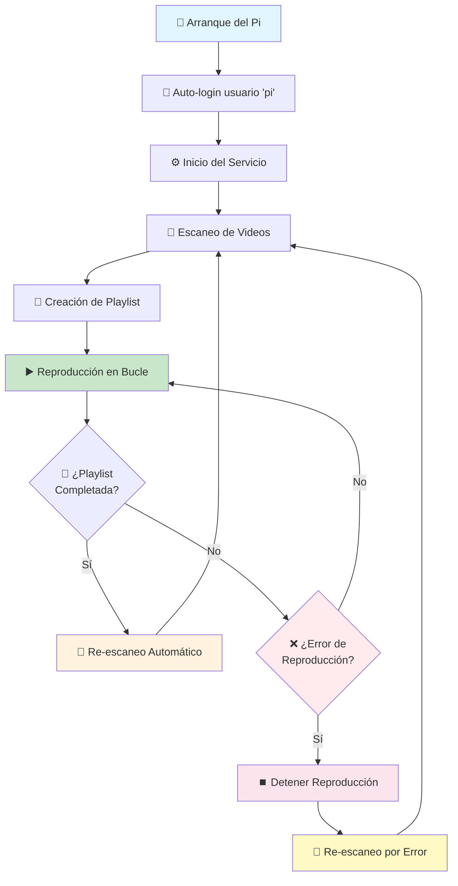

# Documento de Requisitos del Producto - Sistema de Cartelería Digital Raspberry Pi

## 1. Descripción General del Producto

Sistema de cartelería digital basado en **Raspberry Pi 3 A+** que reproduce videos en bucle continuo de forma autónoma.
El sistema está diseñado específicamente para funcionar sin intervención del usuario en Raspberry Pi OS Lite (sin sistema de ventanas).
Proporciona una solución simple y eficiente para mostrar contenido multimedia en pantallas digitales optimizada para las capacidades del Pi 3 A+.

## 2. Características Principales

### 2.1 Módulo de Características

Nuestro sistema de cartelería consta de las siguientes páginas principales:
1. **Sistema de reproducción**: escaneo de directorio, reproducción en bucle, gestión de playlist, refresh periódico.
2. **Servicio del sistema**: configuración de servicio de usuario, auto-inicio, gestión de errores y reintentos.
3. **Configuración del hardware**: configuración de auto-login, configuración de pantalla, optimización del sistema.

### 2.2 Detalles de Páginas

| Módulo | Clase/Función Principal | Descripción de Funcionalidad |
|--------|-------------------------|-------------------------------|
| Sistema de Reproducción | `VideoPlayer` (Adapter), `PlaylistManager` (Strategy) | Reproduce videos automáticamente en bucle desde directorio `/videos/`. Gestiona lista de reproducción dinámica y controla VLC Media Player usando patrones Adapter y Strategy. |
| Servicio del Sistema | `SystemService`, `AutoLoginManager` | Configura servicio systemd para inicio automático. Gestiona auto-login del usuario `pi` y configuración del entorno de ejecución. |
| Configuración del Hardware | `HardwareConfig` (Factory), `DisplayManager` (State) | Optimiza configuración de Raspberry Pi para reproducción de video. Gestiona salida HDMI y configuraciones de rendimiento del sistema usando patrones Factory y State. |
| Sistema de Logging | `Logger` (Singleton), `LogManager` (Observer) | Sistema unificado de logging usando loguru. Gestiona logs del sistema, rotación automática y redirección de salidas usando patrones Singleton y Observer. |

## 3. Proceso Principal

**Flujo del Sistema:**
1. El Raspberry Pi arranca automáticamente
2. El sistema se loguea automáticamente con el usuario 'pi'
3. El servicio de cartelería se inicia automáticamente
4. El sistema escanea el directorio de videos
5. Crea una playlist con todos los videos encontrados
6. Inicia la reproducción en bucle continuo
7. Al completar la playlist, vuelve al paso 4 (re-escaneo)
8. Si hay error durante reproducción, vuelve al paso 4 (re-escaneo)



## 4. Diseño de Interfaz de Usuario

### 4.1 Estilo de Diseño

* **Colores primarios**: No aplica (sistema headless)

* **Estilo de operación**: Completamente automático, sin interfaz gráfica

* **Fuentes**: No aplica (sin GUI)

* **Estilo de layout**: Reproducción a pantalla completa

* **Iconos**: No aplica (operación headless)

### 4.2 Descripción General del Diseño de Páginas

| Nombre de Página        | Nombre del Módulo | Elementos de UI                                                    |
| ----------------------- | ----------------- | ------------------------------------------------------------------ |
| Sistema de reproducción | Reproductor VLC   | Pantalla completa, sin controles visibles, reproducción automática |
| Servicio del sistema    | Logs del sistema  | Accesible solo vía SSH para diagnóstico                            |

### 4.3 Responsividad

El sistema está optimizado para pantallas de 1920x1080 en orientación horizontal. No requiere adaptación responsive ya que funciona en hardware dedicado con resolución fija.

## 6. Convenciones de Desarrollo

### 6.1 Convenciones de Idioma

Este proyecto sigue estrictas convenciones de idioma para mantener consistencia y profesionalismo:

**📝 Código SIEMPRE en Inglés:**
- Nombres de archivos: `video_player.py`, `playlist_manager.py`
- Clases: `VideoPlayer`, `PlaylistManager`, `ErrorHandler`
- Funciones: `scan_directory()`, `play_video()`, `handle_error()`
- Variables: `video_path`, `playlist_items`, `error_count`
- Constantes: `MAX_RETRIES`, `VIDEO_EXTENSIONS`
- Nombres de módulos y paquetes

**📚 Documentación SIEMPRE en Castellano:**
- Docstrings de clases y funciones
- Comentarios en el código (usar con moderación)
- Esta documentación técnica
- Mensajes de log para el usuario final
- Archivos README y documentación del proyecto

**🔤 Excepciones - Usar Inglés entre Comillas:**
Cuando se mencionen en la documentación en castellano:
- Variables de entorno: `"VIDEO_PATH"`, `"LOG_LEVEL"`
- Nombres de clases: `"VideoPlayer"`, `"PlaylistManager"`
- Nombres de funciones: `"scan_directory()"`, `"play_video()"`
- Variables del sistema: `"DISPLAY"`, `"HOME"`

### 6.2 Ejemplo de Implementación con Pydantic

```python
from pydantic import BaseModel, Field, validator
from typing import Optional, List
from pathlib import Path

class VideoPlayerConfig(BaseModel):
    """Configuración del reproductor de video con validación pydantic.
    
    Esta clase define la configuración necesaria para el reproductor,
    optimizada para Raspberry Pi 3 A+ en resolución 1920x1080.
    """
    
    video_path: Path = Field(
        description="Ruta completa al archivo de video a reproducir"
    )
    fullscreen: bool = Field(
        default=True,
        description="Reproducción en pantalla completa"
    )
    volume: int = Field(
        default=100,
        ge=0,
        le=100,
        description="Nivel de volumen (0-100)"
    )
    vlc_options: List[str] = Field(
        default=['--intf', 'dummy', '--fullscreen', '--no-osd'],
        description="Opciones de configuración para VLC"
    )
    
    @validator('video_path')
    def validate_video_exists(cls, v):
        """Valida que el archivo de video exista."""
        if isinstance(v, str):
            v = Path(v)
        if not v.exists():
            raise ValueError(f"Archivo de video no encontrado: {v}")
        return v

class NetworkConfig(BaseModel):
    """Configuración de red WiFi con DHCP dinámico.
    
    Esta clase define la configuración de red para Raspberry Pi,
    usando conexión WiFi exclusivamente con DHCP.
    """
    
    interface_type: str = Field(
        default="wifi",
        description="Tipo de interfaz de red (solo WiFi)"
    )
    dhcp_enabled: bool = Field(
        default=True,
        description="DHCP dinámico habilitado"
    )
    wifi_ssid: Optional[str] = Field(
        default=None,
        description="Nombre de la red WiFi"
    )
    wifi_country: str = Field(
        default="ES",
        description="Código de país para configuración WiFi"
    )
    auto_connect: bool = Field(
        default=True,
        description="Conexión automática al arranque"
    )
    
    @validator('interface_type')
    def validate_interface(cls, v):
        """Valida que solo se use WiFi."""
        if v.lower() != "wifi":
            raise ValueError("Solo se permite conexión WiFi")
        return v.lower()

class SystemConfig(BaseModel):
    """Configuración general del sistema de cartelería.
    
    Esta clase centraliza toda la configuración del sistema
    usando modelos pydantic para validación robusta.
    """
    
    video_player: VideoPlayerConfig
    network: NetworkConfig
    video_directory: Path = Field(
        default=Path('/home/pi/kdx-pi-signage/videos'),
        description="Directorio de videos"
    )
    log_directory: Path = Field(
        default=Path('/home/pi/kdx-pi-signage/logs'),
        description="Directorio de logs"
    )
    refresh_interval: int = Field(
        default=30,
        ge=5,
        le=300,
        description="Intervalo de actualización en segundos"
    )
    
    @validator('video_directory', 'log_directory')
    def create_directories(cls, v):
        """Crea los directorios si no existen."""
        if isinstance(v, str):
            v = Path(v)
        v.mkdir(parents=True, exist_ok=True)
        return v

# Ejemplo de uso
config = SystemConfig(
    video_player=VideoPlayerConfig(
        video_path=Path('/home/pi/kdx-pi-signage/videos/demo.mp4')
    ),
    network=NetworkConfig(
        wifi_ssid="MiRedWiFi"
    )
)
```

## 5. Especificaciones Técnicas

### 5.1 Requisitos del Sistema

* **Hardware**: Raspberry Pi 3 A+

* **Sistema Operativo**: Raspberry Pi OS Lite (headless)

* **Python**: Versión 3.11 o superior

* **Memoria**: 512MB RAM (integrada en Pi 3 A+)

* **Almacenamiento**: Tarjeta microSD de 32GB o superior (Clase 10 recomendada)

### 5.2 Dependencias de Software

* **VLC Media Player**: Para reproducción de video

* **OpenCV**: Para procesamiento futuro de video

* **FFmpeg**: Para manipulación de archivos multimedia

* **python-vlc**: Bindings de Python para VLC

* **uv**: Gestor de paquetes y entorno virtual

### 5.3 Formatos de Video Soportados

* **Resolución**: 1920x1080 (Full HD)

* **Orientación**: Horizontal únicamente

* **Formatos**: Todos los formatos soportados por VLC (MP4, AVI, MKV, etc.)

* **Códecs**: H.264, H.265, VP9 (recomendados para mejor rendimiento)

### 5.4 Estructura de Directorios

```
/home/pi/kdx-pi-signage/
├── main.py                 # Script principal
├── pyproject.toml         # Configuración del proyecto
├── videos/                # Directorio de videos
└── logs/                  # Logs del sistema
```

